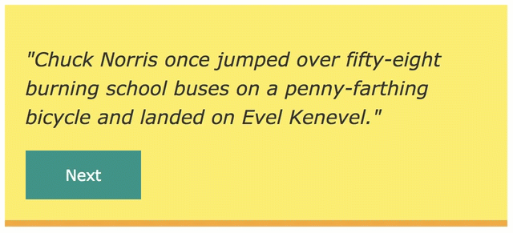

# chuck-norris-jokes Web Component

[](https://greenkeeper.io/)

This is a basic chuck-norris-jokes Web Component to display random Chuck Norris jokes created with [StencilJS]. This Web Component uses the [Chuck Norris API] to fetch randomly Chuck Norris jokes.

Checkout the [Demo] / [Demo with Editor].



## Getting Started

**Use Web Component as script tag**

Put the following script tag in the head of your index.html file
```
<script src="https://unpkg.com/stencil-chuck-norris-jokes@latest/dist/chuck-norris-jokes.js"></script>
```
**Use Web Component with npm**
```
npm install stencil-chuck-norris-jokes@latest --save
```

**Use Web Component in template**
```
<chuck-norris-jokes firstname="" lastname=""></chuck-norris-jokes>
```

## API

**Properties**
- firstname: Overwrites `Chuck` by the defined value
- lastname: Overwrites `Norris` by the defined value

## Stencil

Stencil is a compiler for building fast web apps using Web Components.

Stencil combines the best concepts of the most popular frontend frameworks into a compile-time rather than run-time tool.  Stencil takes TypeScript, JSX, a tiny virtual DOM layer, efficient one-way data binding, an asynchronous rendering pipeline (similar to React Fiber), and lazy-loading out of the box, and generates 100% standards-based Web Components that run in any browser supporting the Custom Elements v1 spec.

Stencil components are just Web Components, so they work in any major framework or with no framework at all.

[Demo]: https://stencil-chuck-norris-jokes.stackblitz.io/
[Demo with Editor]: https://stackblitz.com/edit/stencil-chuck-norris-jokes?file=index.html
[StencilJS]: https://stenciljs.com/
[Chuck Norris API]: https://api.chucknorris.io/